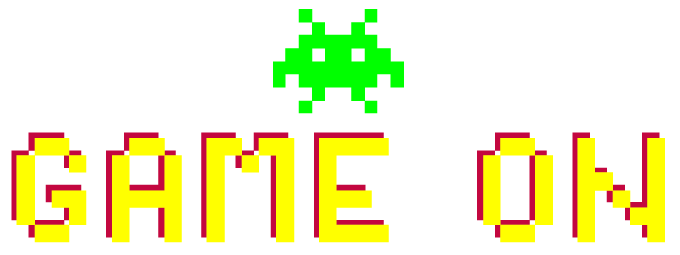

  

---

This is my capstone-project "Game On". A mobile-app for video games.

  

You can make a list of games you like. The search bar got autocompletion and is connected to one of the biggest video-game-database "RAWG".

After adding a game to your list, you can click on it and get further informations to the game.
